## beauty

采用Material风格设计的美妆领域的app, 集成了摄像头取色, 朋友圈, 贴图, 滤镜, 等功能. 

## Features

- 主要功能: 面部识别试妆, 摄像头取色, 美妆资讯, 美妆实验室, 个人栏目, 朋友圈, 照片滤镜等编辑, 笔记, 更换主题, 设置
  
- 选择不同的偏好, 推送不同的资讯与用户定位
  
- ~~色调里面可以面部识别,选择不同产品产品试妆~~
  
- 摄像头取色, 获取颜色相近的产品
  
- 灵感类文章推送, 让用户从中获取美妆灵感
  
- 自己的美妆实验室, 尝试市场上各种美妆产品, 进行试色, 测评, 并进行打分与评论
  
- 个人详情里面可进行个人档案的管理, 我的肤质测试等
  
- 朋友圈功能, 可发文字+图片, 图片可进行二次编辑, 增加标签, 滤镜等
  
- 美妆笔记功能, 随时记录自己的美妆感悟与灵感, 并可云共享
  
- 主题更换功能
  
- 设置
  
  ​

## Screenshots

<a href="art/00.png" style="padding: 10px;">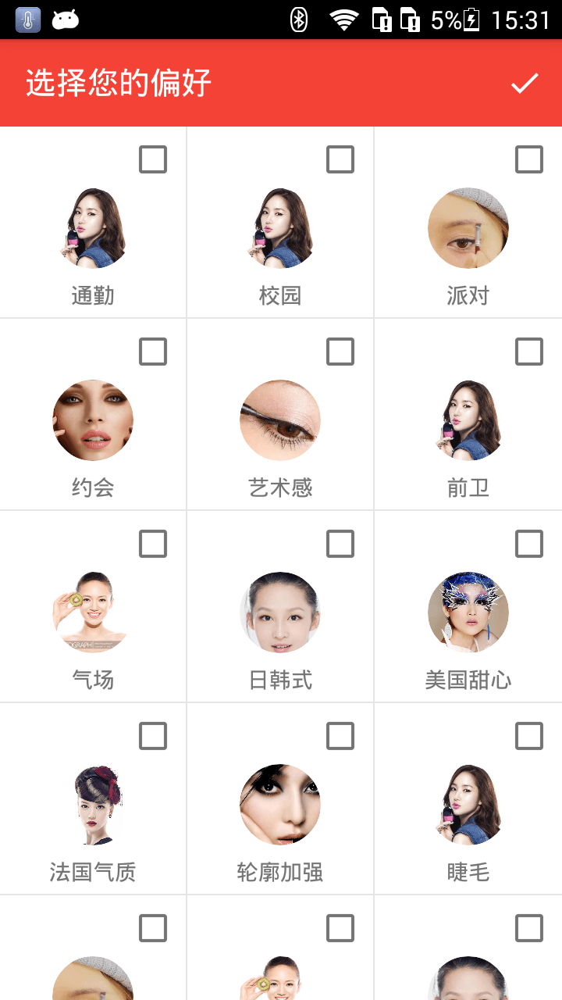</a><a href="art/00.png" style="padding: 10px;">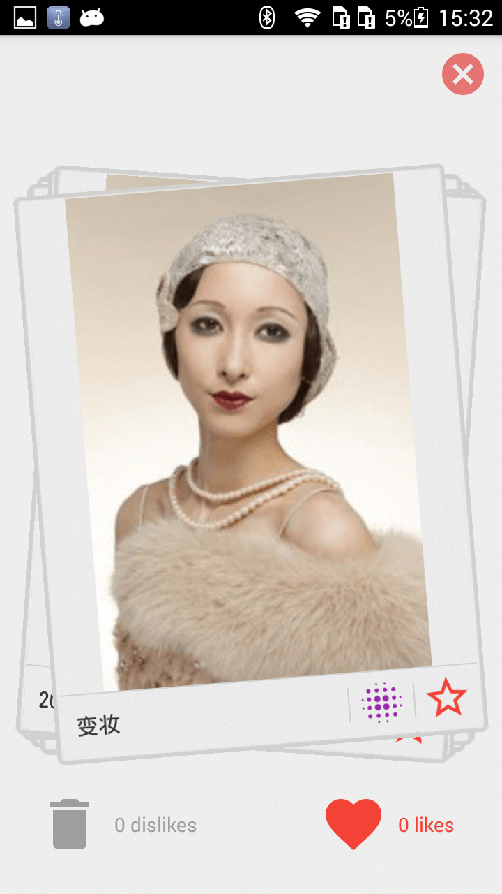</a><a href="art/00.png" style="padding: 10px;">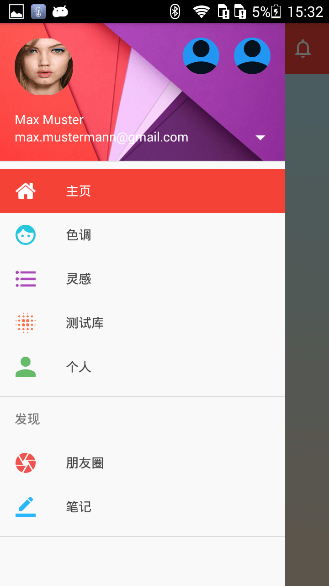</a>

<a href="art/00.png">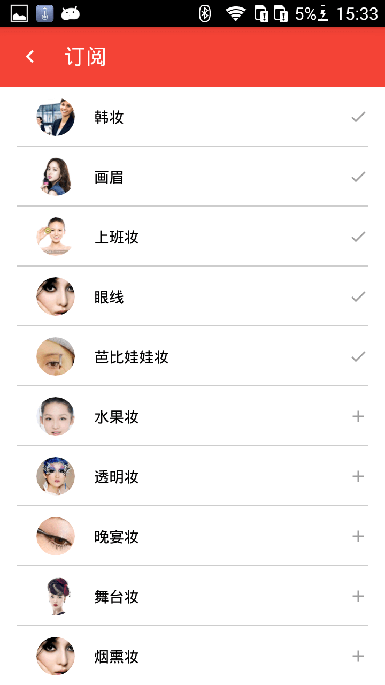</a>

<a href="art/00.png">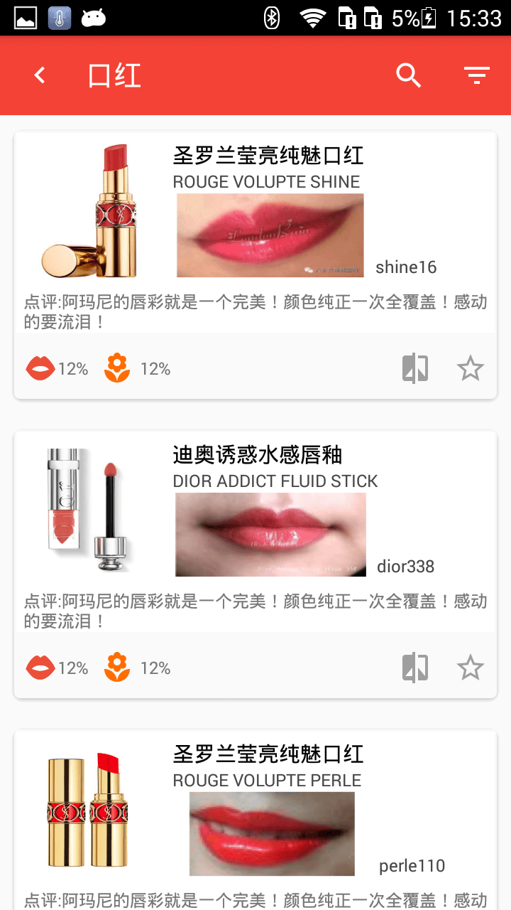</a><a href="art/00.png">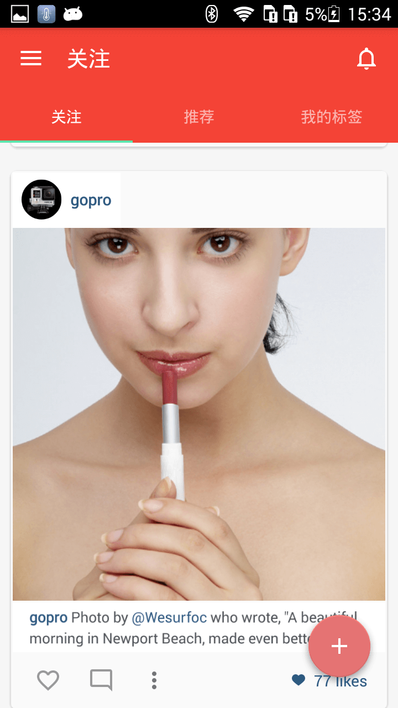</a>

<a href="art/00.png">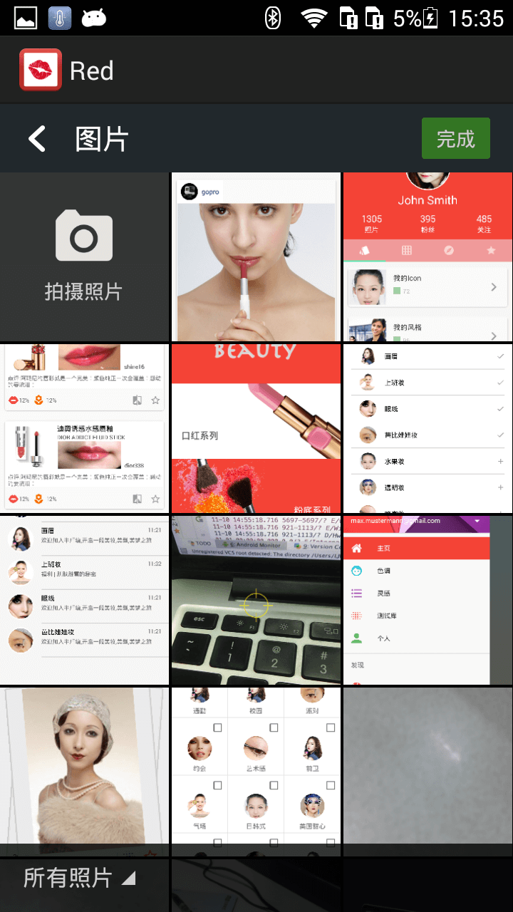</a><a href="art/00.png">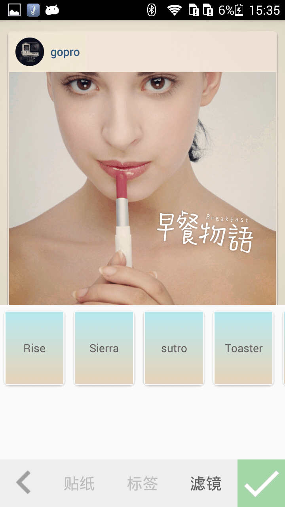</a><a href="art/00.png">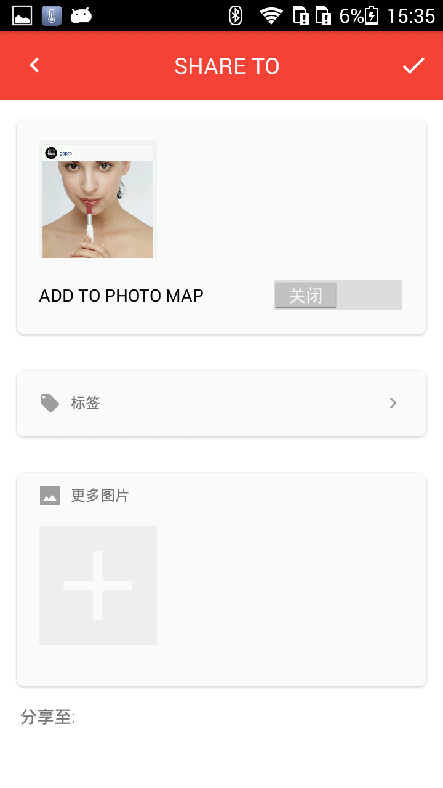</a>

<a href="art/00.png">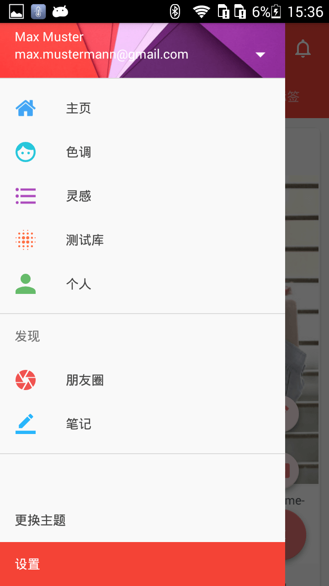</a><a href="art/00.png">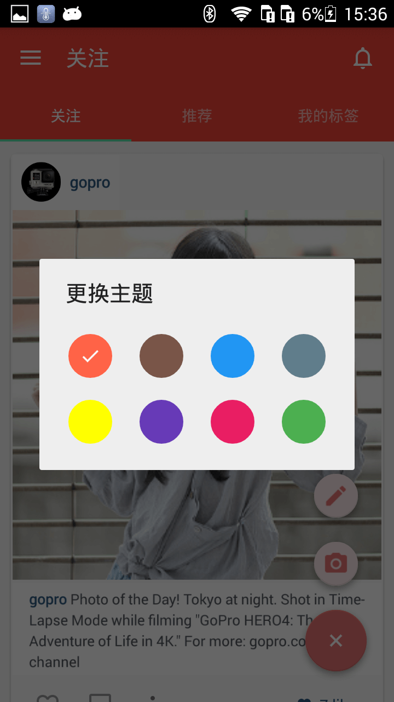</a>

## TODO

- 人脸识别框架的引入
  
- 项目比较早了, 需要跟新
  
  ​

## Statement

该项目仅供交流学习使用.

## Thanks

由于项目比较早了, 好多参考的开源项目不记得引用的哪里了, 如有问题, 麻烦联系我哈~

## About me

[kkooff114 blog​]: http://blog.loujiwei.cn	"kkooff114`blog"